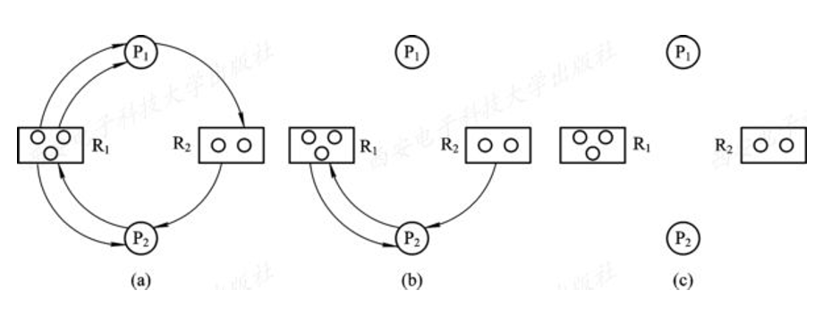
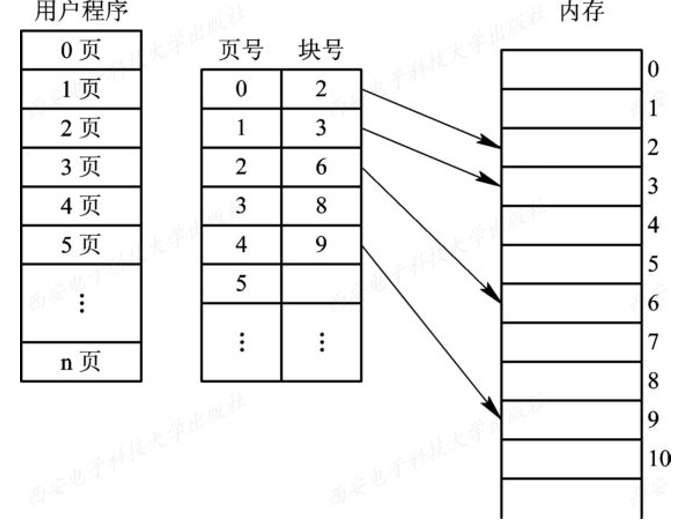

# 2 进程

### 2.3 进程控制

#### 2.3.1 操作系统内核

- 支撑功能
  - 中断处理
  - 时钟管理
  - 原语操作

#### 2.3.2 进程的创建

- 进程树
- 引起创建进程的事件
  - 用户登录：启动操作系统时启动的第一个进程
  - 作业调度：计时器计时结束执行
  - 提供服务：后台的一些服务
  - 应用请求：打开应用

#### 2.3.3 进程的终止

- 引起进程的终止
  - 正常结束：程序正常结束
  - 异常结束：程序发生异常
  - 外界干预；用户手动关闭进程

#### 2.3.4 进程的阻塞与唤醒

- 引起教程阻塞和唤醒的事件
  - 向系统请求共享资源失败
  - 等待某种操作的完成
  - 新数据尚未到达
  - 等待新任务的到达

#### 2.3.5 进程的挂起与激活

- 用户手动暂停程序

### 2.4 进程同步

#### 2.4.1 进程同步的概念

- 概念：不同进程同时竞争使用相同的资源的时候才需要进程同步
- 临界资源：被不同的进程所同时使用的资源
- 临界区：每个进程访问临街资源的那段代码称为临界区

#### 2.4.3 信号量控制

- 信号量：用来控制进程快慢的变量，本质上就是一个变量
- 整型信号量：代表临界资源剩余个数，还有多少进程可以抢，负数代表资源还缺多少
- 信号量的基本操作：

  - wait(P)：等待且占用一个临界资源
  - signal(V)：释放一个占用的临界资源
  - 原理代码：

    ```cpp
    wait(S) {
    	while(S<=0) {
    		;
    	}
    	S--;
    }

    signal(S) {
    	S++;
    }
    ```

- 记录型信号量：wait 时，如果没有紧接资源，则中断，不重复循环

  - 原理代码：
    ```cpp
    wait(S) {
    	if (S <= 0) {
    		中断;
    	}
    	S--;
    }
    ```
  - 目前操作系统使用的是记录型信号量

- AND 与型信号量：进程往往需要多个共享资源

#### 2.4.4 信号量的应用

- 互斥：设置一个互斥信号量 mutex，使多个资源能够互斥的访问某个临界资源
  - 初始值为 1，同一时间只有一个进程可以访问，达到互斥的目的
- 用信号量实现前驱关系（重点）
  - 书上 62 页代码(按照关系定义信号量)
  - 改版(按照任务定义信号量)
    ```cpp
    a = b = c = d = e = 0;
    p1() {S1; signal(a); signal(a);}
    p2() {wait(a); S2; signal(b); signal(b);}
    p3() {wait(a); S3; signal(c);}
    p4() {wait(b); S4; signal(d);}
    p5() {wait(b); S5; signal(e);}
    p6() {wait(c); wait(d); wait(e); S6;}
    ```

#### 2.4.5 管理机制

- 管程：包含信号量的对象，在一些数据结构中把信号量也封装进去的对象。

### 2.5 经典的进程同步问题

#### 2.5.1 生产者-消费者问题

- 临界资源：缓冲池
- 当缓冲池未满，生产者就会生产消息送入缓冲池
- 当缓冲池未空，消费者就会将缓冲池中消息拿出
- 原理代码书上 66 页
- 生产和消费的过程的代码，在临界区外，不会因为生产和消费的过程影响其它进程

#### 2.5.2 哲学家进餐问题

- 原理代码书上 69 页
- 使用 AND 型信号量解决死锁问题

#### 2.5.3 读者-写者问题

- 临界资源：readcount
- 原理代码书上 71 页
- rmutex 用来保护 readcount

### 2.6 进程通信

### 2.7 线程

#### 概念

- 进程是一个可拥有资源的独立单位
- 线程是最基本的 CPU 调度单位

# 3 处理机调度与死锁

### 3.1 调度

#### 3.1.1 处理机调度层次

- 高级调度
- 低级调度
  - 分时操作系统，以时间片为单位，进程的调度, 时时刻刻都在发生
- 中级调度

#### 3.1.2 调度算法的目标

- 调度算法的共同目标：提高 cpu 利用率
- 批处理系统的目标：系统吞吐量高(吞吐量：单位时间完成的作业数)
- 分时系统的目标：响应时间快；均衡性
- 实时系统的目标：截止时间的保证

### 3.2 作业调度

#### 3.2.3 作业调度算法

- 先来先服务(FCFS)调度算法：先到先得
- 短作业优先(SJFS)调度算法：先做简单的，提高吞吐量，可能会导致任务量大的作业一直被插队一直再等待
- 优先级调度算法

#### 3.2.4 优先级调度算法和高响应比优先调度算法

- 优先级调度算法(静态)：每有一个作业进来时，给其设置优先级
- 高响应比优先调度算法(动态)：
  - 响应比：R_p = (等待时间 + 要求服务时间) / 要求服务时间 = 响应时间 / 要求服务时间
  - 这种方法设置的优先级不止考虑了任务量还考虑课等待时间

### 3.3 进程调度

#### 3.3.1 进程调度的任务、机制和方式

- 进程调度的任务
  - 保存处理机现场
  - 按照某种算法选取进程
  - 把处理器分配给进程
- 进程调度方式
  - 非抢占式
  - 抢占式

#### 3.3.2 轮转调度算法

- 原理
  - 类似排队，每个任务运行一个时间片后，重新从队尾排队
  - 时间片是关键指标
- 时间片大小确定
  - 时间片越长，交互越好，因为更容易在同一个时间片把任务做完
  - 时间片过长，就会失去分时性，接近批处理系统

#### 3.3.3 优先级调度算法

- 优先级的类型
  - 静态优先级：优先级高，获取到时间片的概率越高
  - 动态优先级：考虑任务多久没有拿到时间片了，时间越久，优先级越高

#### 3.3.4 多队列调度算法

- 针对多核 cpu
- cpu 资源分配不均衡，可能会许多复杂的任务排在了一个队列，然后其它队列排了许多简单的任务，导致一个队列很忙一个队列很闲

#### 3.3.5 多级反馈队列调度算法

- 在多队列的基础上，解决了负载不均衡的问题
- 原理：在每个队列的任务运行结束后，去下一个队列去排队

#### 3.3.6 基于公平原则的调度算法

### 事实调度

#### 3.4.2 实时调度算法分类

- 非抢占式调度算法
  - 非抢占式轮转调度算法
  - 非抢占式优先调度算法
- 抢占式调度算法
  - 基于时钟中断的抢占式优先级调度算法
  - 立即抢占的优先级调度算法

#### 3.4.3 最早截止时间优先算法(EDF)

#### 3.4.4 最低松弛度优先算法(LLF)

#### 3.4.5 优先级倒置

### 3.5 死锁

#### 3.5.2 引起死锁的条件

- 竞争不可抢占资源
- 竞争可消耗资源
- 进程推进顺序不当引起死锁

#### 3.5.3 产生死锁的必要条件和处理死锁的方法

- 产生死锁的必要条件
  - 互斥条件 —— 一个资源只能给同一个进程
  - 请求和保持条件 —— 占用一个资源还要申请另一个资源
  - 不可抢占条件 —— 占用了一个资源，别人拿不走
  - 循环等待条件 —— 要形成回路，大家互相争抢资源，我要你的，你要他的，他要我的
- 处理死锁的方法
  - 时间线：预防死锁 -> 避免死锁 -> 检测死锁 -> 解除死锁
  - 预防死锁(开发人员做的, 系统设计阶段, 考虑好死锁的可能，尽可能解除死锁的隐患)
  - 避免死锁(操作系统做的, 操作系统感觉你这个位置可能会死锁，操作系统进行干预)
  - 检测死锁(操作系统做的, 时间长了之后，操作系统检测你是否有循环，等待)
  - 解除死锁(杀掉一部分进程)

### 3.6 预防死锁

#### 3.6.1 破坏产生死锁其中的"请求和保持"必要条件

- 原理：当一个进程请求一个资源时，它不能持有不可抢占资源

#### 3.6.2 破坏产生死锁其中的"不可抢占"必要条件

- 原理：当请求新的资源不能得到满足时，需要释放已经获取到的资源

#### 3.6.2 破坏产生死锁其中的"循环等待"必要条件

- 原理：使每个进程请求资源的顺序相同
- 实现方法：将所有资源排序标号，每个进程申请资源的时候按照资源的序号顺序申请

### 3.7 避免死锁

- 原理：在资源分配的时候，如果多个进程同时申请相同的资源，那么哪个进程需要的资源少，就先把资源给哪个进程，因为需要的资源少，先让它拿到所有资源，然后它运行完了之后好尽快再释放出来。
- 安全状态：只要能找到一种可以使所有进程都运行完的分配方法，这种情况就成为安全状态

    - 安全状态例子  
      假定系统中有三个进程 P1、P2 和 P3，共有 12 台磁带机。进程 P1 总共要求 10 台磁带机，P2 和 P3 分别要求 4 台和 9 台。假设在 T0 时刻，进程 P1、P2 和 P3 已分别获得 5 台、2 台和 2 台磁带机，尚有 3 台空闲未分配，如下表所示

    - >| 进程  | 最大需求 | 已分配 | 可用  |
      >| :---: | :------: | :----: | :---: |
      >|  P1   |    10    |   5    |   3   |
      >|  P1   |    4     |   2    |       |
      >|  P1   |    9     |   2    |       |
- 操作系统只要在资源分配的时候只要保证是从一个安全状态转化到另一个安全状态，就可以避免死锁
- 银行家算法
    - 例子
    - >| 资源情况 | 最大需求 | 已分配 | 还需要 | 可用  |
      >| :------: | :------: | :----: | :----: | :---: |
      >|   进程   |  A B C   | A B C  | A B C  | A B C |
      >|    P0    |  7 5 3   | 0 1 0  | 7 4 3  | 3 3 2 |
      >|    P1    |  3 2 2   | 2 0 0  | 1 2 2  |       |
      >|    P2    |  9 0 2   | 3 0 2  | 6 0 0  |       |
      >|    P3    |  2 2 2   | 2 1 1  | 0 1 1  |       |
      >|    P4    |  4 3 3   | 0 0 2  | 4 3 1  |       |
    - 过程：
    	- 当前可用资源A->3, B->3, C->2
		- 判断当前进程P0可不可以完成，不可以，继续向下看
		- 判断当前进程P1可不可以完成，可以，将资源给P1
		- P1执行完后当前可用变为A->5, B->3, C->2
		- 判断当前进程P0可不可以完成，不可以，继续向下看
		- 判断当前进程P2可不可以完成，不可以，继续向下看
		- 判断当前进程P3可不可以完成，可以，将资源给P3
		- P3执行完后当前可用变为A->7, B->4, C->3
		- 判断当前进程P0可不可以完成，可以，将资源给P0
		- P0执行完后当前可用变为A->7, B->5, C->3
		- 判断当前进程P2可不可以完成，可以，将资源给P2
		- P2执行完后当前可用变为A->10, B->5, C->5
		- 判断当前进程P4可不可以完成，可以，将资源给P4
		- P4执行完后当前可用变为A->10, B->5, C->7
		- 至此，所有进程均可执行完

### 3.8 死锁检测与解除
- 资源分配图
- 资源分配图的简化
  
  说明：
	- 从a到b，P2申请R1，但是R1资源两个被P1拿去，一个被P2拿去，所以P2申请不到，P2不可化简
	- P1申请R2，R2有一个被P2拿去，还剩一个，P1可以申请到，所以P1可以简化(删掉所有与其相关的边)
	- b到c，此时P2申请R1，R1中给P1的资源已被释放，所以P2可以申请到了，所以P2简化
	- 至此，资源分配图得到完全简化
- 死锁定理：如果资源分配图不能够完全简化，则当前发生了死锁
- 解除死锁：杀进程释放当前进程所占用的资源

# 4 存储器管理

### 4.1 存储器的层次结构
- 计算机系统存储层次示意图

### 4.2 程序的装入和链接
- 步骤：
  - 编译
  - 链接
  - 装入

### 4.3 连续分配存储管理方式(过时)
- 两种分配方式
  - 按顺序，会造成内存产生很多外碎片，导致再分配时难以分配
  - 二分法分区，内存越大，内碎片越多，浪费越多

### 4.4 对换(过时)
### 4.5 分页存储管理方式(重点)
- 连续分配的改进
- 原理：
  - 将内存分成多个页，每个页固定多少空间
  - 每当进程申请空间时，将若干个页分配给改进程
  - 分配时，会为进程生成一个页表
  - 页表实现了将不连续的内存映射成连续的空间
  - 页表会根据实际用到的空间分配物理内存
- 好处：使内碎片减少，内碎片最多为(每页的固定空间)
- 图示：  
  
- 快表优化页表速度，将两次访问内存变成一次

# 5 虚拟存储器

### 5.1 虚拟存储器概述
- 局部性原理
  - 时间局部性：一段时间访问的运行的代码都是那么几行
  - 空间局部性：一段时间操作的数据，变量都是那么几个
- 虚拟存储器的实现方法

### 5.3 页面置换算法
- 最佳页面置换算法(Optimal)
  - 原理：将距离当前最远的页号移除
  - 不可行，因为不知道程序未来访问页号的顺序
  - 用来评价其它算法的性能
- 先进先出置换算法(FIFO)
  - 原理：循环队列
- 最近最久未使用置换算法(LRU)
  - 原理：用过去预测未来，之前经常用的页号，未来大概率会经常用，过去好久没用的页号，未来大概率也不会怎么用，所以把最久未使用的页号置换出去
- 最少使用置换算法(LFU)
  - 原理：用过去预测未来，之前用的最多的页号，未来大概率会用，之前用的少的页号，未来大概率不会怎么用，所以把最少用到的页号置换出去
- Clock算法(了解就行)
  - LRU的改进 
- 页面缓冲算法

### 5.4 "抖动"与工作集

# 6 输入输出系统

### 6.1 I/O软件的层次结构
- 用户层软件：产生I/O请求
- 设备独立性软件：给用户层软件提供SDK，通过DDK调用设备驱动程序
- 设备驱动程序
- 中断处理程序：由于CPU速度比IO快，没必要等IO，所以用中断异步处理
- 硬件：I/O卡

### 6.2 I/O设备和设备控制器
- I/O设备：鼠标，键盘，显示器
- 设备控制器：连接I/O设备的卡

### 6.3 中断机构和中断处理程序
- 中断：外围设备产生的
- 陷入：CPU产生了，例如主动调用了`INT 21`，或者遇到除数为0的时候

### 6.4 设备驱动程序
- 硬件厂商提供的软件程序

### 6.6 用户层I/O软件
- 系统调用 
- 库函数
- Spooling 假脱机技术，常用在打印机的使用

### 6.7 缓冲区管理
- 由于两者之前速度不匹配，所以需要建立缓冲区
- 单缓冲区：成本低，不能同时读写，需要同步
- 双缓冲区：不需同步，但是如果速度差过大，会造成一个缓冲区写完了，另一个还没读完，就要等待
- 环形缓冲区：类似生产者消费者问题，解决了双缓冲区的问题，但是每个设备都有一个环形缓冲区成本太高
- 缓冲池：使所有设备都使用同这一个缓冲池，解决了环形缓冲区的成本高问题

# 7 文件管理

### 7.1 文件和文件系统
- 文件名：文件的名字
- 扩展名：文件的类型
- 按照存取控制属性分类
  - 只读文件
  - 读写文件
  - 只执行文件
- 基本文件操作
  - 创建/删除 文件
  - 读/写 文件
  - 设置文件的 读/写 位置

### 7.2 文件的逻辑结构
- 文件的逻辑结构
- 文件的物理结构，又称文件的存储结构
- 按文件是否有结构分类
  - 有结构文件
  - 无结构文件
- 按文件组织方式分类
  - 顺序文件
  - 索引文件
  - 索引顺序文件

### 7.3 文件目录
- 文件目录的作用
  - 实现“按名存取”
  - 提高对目录的检索速度
  - 文件共享
  - 允许文件重名
- 文件控制块
- 单级文件目录
- 两级文件目录
- 多级目录结构

### 7.4 文件共享
- 有向无循环图目录层次(一个文件存在于不同目录中)
- 符号链接实现文件共享(快捷方式)

### 7.5 文件保护
- 访问矩阵