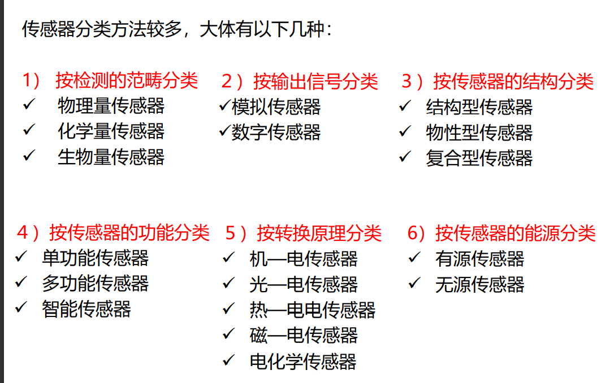

# 1 物联网概述
- 物联网(Internet of Things, IoT)
- 物联网元年 2010年
- 物联网的定义：
	- 物联网是通过使用射频识别、传感器、红外感应器、全球定位系统、激光扫描器等信息采集设备，按..未完待续。
	- 将“检测与控制”、“传输与通信”、“计算机有机融合在一起”，是典型的3C融合技术
	- 物联网=物理世界与信息网络的无缝链接

# 3 物联网的体系架构
- IEEE  
  - 电气与电子工程师协会(Institute of Electrical and Electronics Engineers)，简称IEEE，总部位于美国纽约，是一个国际性的电子技术与信息科学工程师的协会，也是全球最大的非营利性专业技术学会
- 物联网三个层次 ([传送门](https://zhidao.baidu.com/question/1820076050240831708.html))
    - 感知层
    - 网络层
    - 应用层

# 4 自动识别技术
- 自动识别技术的特点
    - 准确性：自动数据采集，彻底消除人为错误
    - 高效性：信息交换实时进行
    - 兼容性：可与信息管理系统无缝联结
- 自动识别技术的组成，自动识别技术可分为
    - 条码识别技术
    - 射频识别技术
    - 卡类识别技术
    - 机器视觉识别技术
    - 生物特征识别技术
    - 等
- ==卡识别技术的分类==
    - 非半导体卡
    - 半导体卡——IC卡
- 机器视觉涉及的学科
    - 人工智能
    - 神经生物学
    - 心理物理学
	- 计算机科学
	- 图像处理
	- 模式识别
- 二维码的三个正方形框相当于一维码的左护线和右护线

- RFID系统的工作原理
    - 时序
        - 阅读器先发言(RTF)
        - 标签先发言(TTF)

# 5 物联网感知技术

> 物联网与传统网络的主要区别在于，物联网扩大 了传统网络的通信范围，即物联网不仅仅局限于人与人之间的通信，还扩展到人与物、物与物之 间的通信。针对物联网具体实现过程中，对物的信息感知是关键环节技术，本章主要介绍**传感器**组成、分类和特性，传感器的选用原则，智能传感器和无线传感的发展及特点等。

- 传感技术
    - 是关于从自然信源获取信息，并对之进行处理（ 变换）和识别的一门多学科交叉的现代科学与工程技术， 它涉及**传感器**（又称换能器）、信息处理和识别的规划设计、开发、制造或建造、测试、应用及评价改进等活动。

- **信息技术的三大支柱**
    1. 传感技术
    2. 计算机技术
    3. 通信技术

## 5.1 传感器技术概述

- 组成

    - 敏感元件
    - 转换元件
    - 转换电路

    ~~~mermaid
    graph LR
    	id1(敏感元件) --> id2(转换元件) --> id3(转换电路) 
    ~~~
- **信息处理**

    1. 信息的预处理
    2. 后置处理
    3. 特征提取与选择 等

- 识别的主要任务

    - 对经过处理信息进行辨识与分类

- 从输入与输出的关系来看

    - 它们之间的关系具有“一定规律”，即传感器的输入与输出不仅是相关的，而且可以<u>**用确定的数学模型来描述**</u> ，也就是具有确定规律的静态特性和动态特性

- 当前传感器技术的发展趋势

    - 微型化
    - 智能化
    - 多样化

## 5.2 典型的传感器

**传感器的通用原理**

- 传统的传感器包括两种类型的处理技术

    1. 模拟信号处理技术
    2. 数字信号处理技术

    > 从物理变量获取的信号通常是模拟形式的

- 信号调理电路

    - 主要技术：电子技术——运算放大器

**传感器的特性**

- 特性：指传感器的输入量和输出量之间的对应关系
    1. 静态特性
        - 是指被测量的值处于**稳定状态时**的 输出/输入关系
        - 衡量静态特性的重要指标
            1. 线性度
            2. 灵敏度
            3. 迟滞和重复性 等
    2. 动态特性
        1. 阶跃响应特征
        2. 频率响应特征

**传感器的分类**

1. 按被测物理量分类
2. 按传感器的工作原理分类
    1. 物性型传感器
    2. 结构型传感器
    3. 化学型传感器
    4. 生物传感器
3. 按信号变换特征分类
    1. 能量转换传感器（无源传感器）
    2. 能量控制型传感器（有源传感器）

**几种典型的传感器**

1. 温度传感器
2. 温敏传感器
3. 光电传感器
4. 光纤传感器
5. 图像传感器
6. 气敏传感器
7. 压力传感器
8. 加速度传感器

**选用传感器的原则**

1. 根据测量对象与测量环境确定传感器的类型
2. 灵敏度的选择
3. 频率响应特性
4. 线性范围
5. 稳定性
6. 精度

## 5.3 智能传感器

**智能传感器**

- 就是一种带行微处理机的，兼有 信息检测、信息处理、信息记忆、逻辑思维 与判断功能的传感器。

## 5.4 无线传感器

当今国内无线传感器的发展方向大多集中在对于传感器数据接收的网络节点处，并且对用于信息处理的硬件设备也有部分研究。

而伴随研究的不断深入与科技创新的不断突破，无线传感器已经开始向着**智能式与便携式方向**发展，它作为**协作技术的核心部分**，其前景不可限量。

# 6 物联网通信技术

**以无线网络为核心**

**物联网通信技术**

1. 近距离无线通信技术
2. 有线传输技术
3. 远距离无线通讯技术
4. Internet 技术

1. 利用近距离的通信技术实现了感知数据的汇聚，局域网
2. 利用Internet技术实现了数据的共享

## 6.1 远距离无线通信技术

在偏远岛屿、地区，常用远距离无线

- **常规远距离无线通信技术**
    1. 卫星通信技术
    2. 微波通信技术
    3. 移动通信技术

- **微波通讯技术**
    1. 穿透
    2. 反射：金属类
    3. 吸收：食物
- **卫星通信技术**
- **移动通信技术**

